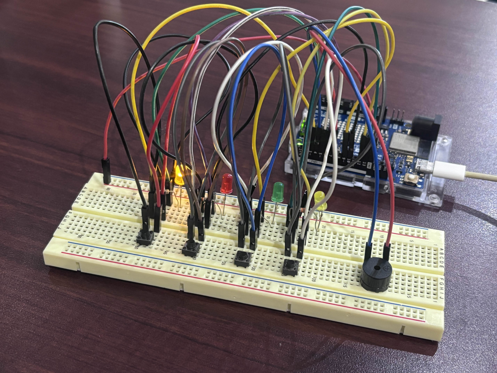

# Physical Computing Project 2025 - IT KMITL
🟡 🔴 🟢 🟡
 
PopepopepopopepoGame Project 🐈💡

## จุดประสงค์
* เพื่อศึกษาการต่อวงจรบอร์ด Arduino
* เพื่อฝึกความจำและสมาธิ
* เพื่อความสนุกสนาน ผ่อนคลาย

## บทคัดย่อ
โปรเจค Popepopepopopepo Game เป็นโปรเจคที่ใช้บอร์ด Arduino UNO R4 WiFi ในการต่อวงจรเกม LED Sequence โดยการเล่นเกมนี้ คือ ผู้เล่นต้องกดไฟที่กระพริบตามลำดับให้ถูกต้อง ภายในระยะเวลาที่โปรแกรมกำหนดไว้ หากแพ้ เกมจะรีเซตเริ่มต้นใหม่ที่ Level 1 ซึ่งเกมนี้สามารถเล่นได้เรื่อย ๆ จำนวนครั้งที่ต้องกดปุ่ม แปรผันตามจำนวน Level ที่เพิ่มขึ้น แสดงผลลัพธ์ของการเล่นเกมบน Web browser ได้แก่ 1. Level ที่ผ่านล่าสุด (อัปเดตเรื่อย ๆ ขณะเล่นเกม) 2. Score Broad 5 อันดับสูงสุด และเมื่อกดปุ่ม "Reset Scores" คือ การรีเซต Score Broad นอกจากนี้ยังมีเสียงไฟกระพริบที่เป็นเสียงโน้ตดนตรีอีกด้วย

## 🍡 Project's Website

## 🍮 Video Presentation

## สมาชิก
1. นางสาวชยารัตน์ ฤทธิกุล รหัส 67070031
2. นางสาวชลธิชา คนธภักดี รหัส 67070033
3. นายญาณภัทร นิลสยาม รหัส 67070039
4. นางสาวธัญญา ชนะถาวราลักษณ์ รหัส 67070075
